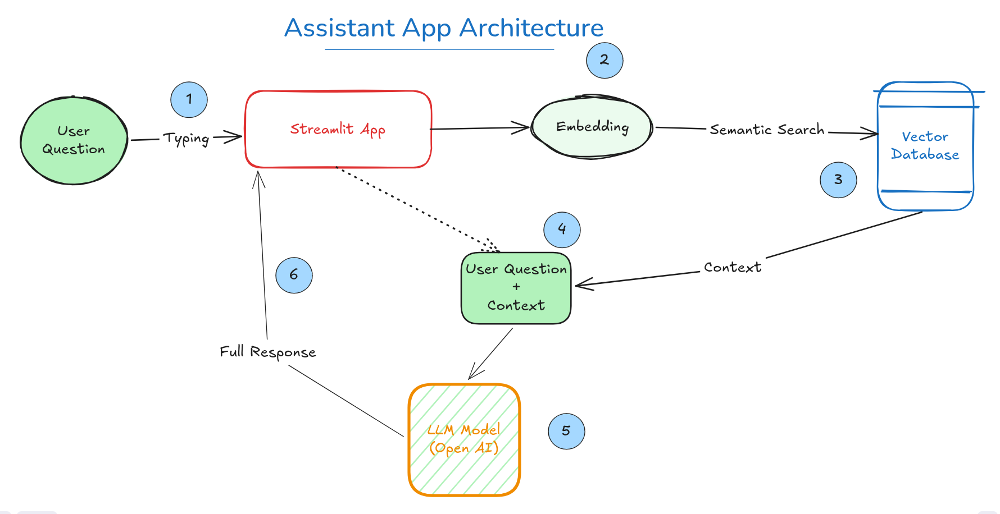
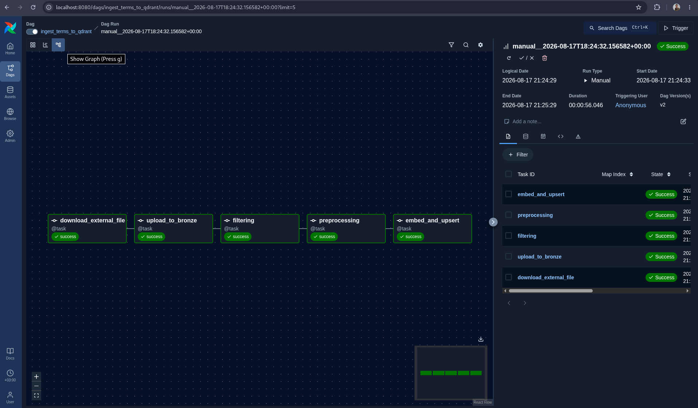
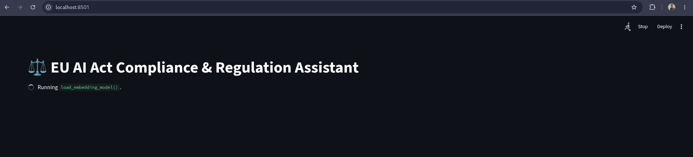
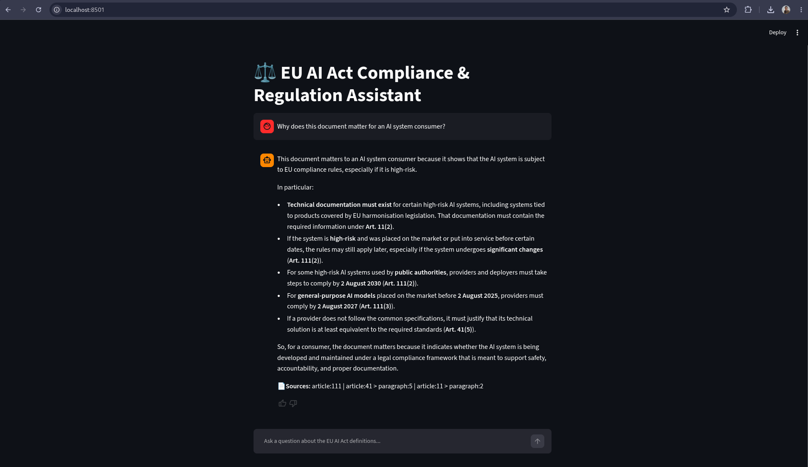
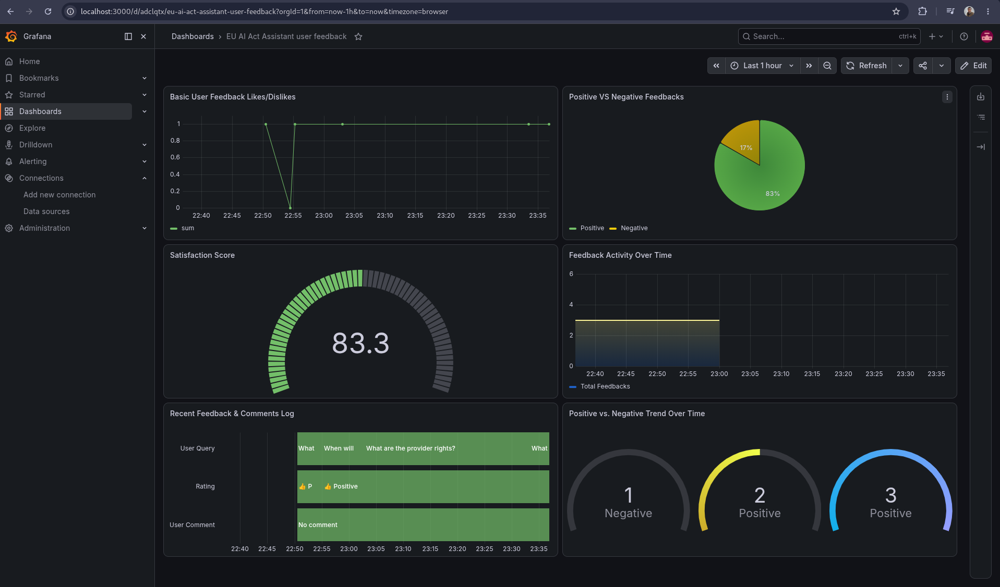

## EU AI Act Compliance & Regulation Assistant

#### Problematic
The EU AI Act, available [here](https://eur-lex.europa.eu/eli/reg/2024/1689/oj), is a complex and multi-layered regulatory framework. For developers, legal teams, and businesses, staying compliant requires constant consultation of dense, technical legal text. Manual lookup is inefficient and prone to error, and keyword-based search often fails to capture the semantic nuance of legal terminology (e.g., differentiating between a "provider" and a "deployer" in specific contexts).


#### Solution
This project implements a Retrieval-Augmented Generation (RAG) pipeline that allows users to interact with the EU AI Act text through natural language. By transforming legal text into semantic vector embeddings, the system retrieves precise, context-aware information. 

It provides a full data engineering pipeline: from automated ingestion to an interactive UI and user feedback monitoring; ensuring transparency, traceability, and ease of access to complex regulations.


### Project Overview

This project is an end-to-end data platform designed to ingest, vectorize, and serve regulatory knowledge. It handles the entire lifecycle of RAG:

0. Dataset: we use the structured version of the document from [@jeroenherczeg on Hugging Face](https://huggingface.co/datasets/jeroenherczeg/eu-ai-act)
1. Orchestration: Automated ingestion and processing using Airflow.

2. Storage of the Knowledge Base: High-performance semantic vector storage with Qdrant and Sentence Transformer.

3. Retrieval: Context-aware semantic search with Sentence Transformer and Qdrant.

4. Generation: LLM-powered answer synthesis with an OpenAI model.

5. Monitoring: Analytics on user interaction and system performance with Grafana.

6. Containerization: Highly portable project with a single docker compose file

### System Architecture & Components
We utilize a containerized stack to ensure reproducibility and scalability with `docker-compose`.

| Component | Role | Why it is used |
| :--- | :--- | :--- |
| **Docker Compose** | Multi-container Orchestration | Ensures the entire environment (Airflow, Qdrant, MinIO, Postgres, Grafana, Streamlit) is 100% reproducible with a single command. |
| **MinIO** | Temporary Object Storage | Acts as a local, S3-compatible staging bucket to hold raw legal document files before vector processing. |
| **Apache Airflow** | Pipeline Orchestration | Schedules and runs the automated ETL pipeline, fetching documents from MinIO, generating vector embeddings, and indexing them into Qdrant. |
| **Qdrant** | Vector Database | Handles high-speed semantic similarity searches and payload metadata filtering for specific legal categories or sources. |
| **Sentence-Transformers** | Embedding Engine | Runs `all-MiniLM-L6-v2` locally via PyTorch to generate 384-dimensional dense vectors without external API dependencies. |
| **Streamlit** | User Interface | Provides a clean, chat-based UI for users to ask questions, view retrieved context, and submit response ratings. |
| **PostgreSQL** | App & Feedback Database | Stores user feedback and interaction logs, kept completely separate from Airflow's internal system database. |
| **Grafana** | Monitoring Dashboard | Visualizes user satisfaction ratings, feedback comments, and query volumes in real time. |


### Running the project
#### 1. Prerequisites
* Docker Desktop (with Docker Compose) installed.
* An `OPENAI_API_KEY` (or equivalent LLM provider key) for the generation step.
* Rename the `.env.example` file to `.env` and add values to the 3 variables there
    * AIRFLOW_UID 
    * AIRFLOW__API_AUTH__JWT_SECRET
    * OPENAI_API_KEY

#### 2. Launch the Infrastructure
From the project root directory, spin up the entire stack with docker compose:
```bash
docker compose up -d
```
This command will build the Streamlit UI, pull the required images, and initialize Qdrant, Postgres, Airflow and Grafana.


#### 3.a. Run the Ingestion Pipeline
Once the containers are up and healthy:
1. Navigate to the Airflow UI (typically http://localhost:8080).

2. Log in and if the credentials are required (use the ones: airflow / airflow).

3. Find the `ingest_terms_to_qdrant` DAG.

4. Toggle the DAG switch to On and click the Play button to trigger a run.

5. Wait for the task to complete successfully.




#### 3.b. Check the files on Minio (optional)
While waiting for the ingestion pipeline to complete, we can visualise temporary files on Minio
1. Navigate to http://localhost:9001.
2. If requested, use the default credentials (minioadmin/minioadmin)
3. Select the bucket `compliance-docs` and explore the existing subfolders and files


#### 4. Start Asking Questions
1. Once the pipeline finishes, navigate to the Streamlit UI ( http://localhost:8501). Then wait for Streamlit to load the embedding model


2. Type your question in the chat input (e.g., "What is an authorised representative?").

3. The app will retrieve relevant legal context, pass it to the LLM, and provide a cited, accurate answer.




#### 5. Retrieval Evaluation
We created a DAG `rag_evaluation` that performs evaluations on 3 typical user questions. The goal is to systematically evaluate the performance of the Qdrant semantic search. 

The Hit Rate and Mean Reciprocal Rank (MRR) are recorded on our Postgres database under the `retrieval_evaluation` table.
For instance, the following table are what we recorded in our last evaluation.
| id | evaluated_at | total_queries | hit_rate | mrr | top_k |
| :--- | :--- | :--- | :--- | :--- | :--- |
| 4 | 2026-08-18 01:02:11.435 | 3 | 0.666667 | 0.444444 | 5 |


#### 6. Monitor
1. Access the Grafana dashboard (http://localhost:3000) and when prompted, use the default credentials (admin/admin)

2. In the left-hand navigation menu, go to Connections > Data sources > Add data source.  Connect the PostgreSQL feedback_db as a data source. Use the following config:

    * Host: `postgres:5432`
    * Database: `feedback_db`
    * User: `airflow`
    * Password: `airflow`
    * SSL Mode: `disable`

3. Observe real-time logs of user feedback and interactions.


#### 5. Demo
https://github.com/user-attachments/assets/c6bb43cc-ba43-49b0-8ab0-e6bf876bbaed